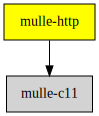

# mulle-http

#### 🈚 http URL parser

The http parser from NGINX, extracted from the NODE code base.
Based on src/http/ngx_http_parse.c from NGINX copyright Igor Sysoev


| Release Version
|-----------------------------------
|  [](//github.com/mulle-c/mulle-http/actions)


### You are here




## Add

Use [mulle-sde](//github.com/mulle-sde) to add mulle-http to your project:

``` sh
mulle-sde dependency add --c --github mulle-c mulle-http
```

## Install

### mulle-sde

Use [mulle-sde](//github.com/mulle-sde) to build and install mulle-http and all dependencies:

``` sh
mulle-sde install --linkorder --prefix /usr/local \
   https://github.com/mulle-c/mulle-http/archive/latest.tar.gz
```

### Manual Installation

Install into `/usr/local`:

``` sh
cmake -B build \
      -DCMAKE_INSTALL_PREFIX=/usr/local \
      -DCMAKE_PREFIX_PATH=/usr/local \
      -DCMAKE_BUILD_TYPE=Release &&
cmake --build build --config Release &&
cmake --install build --config Release
```

## Platforms and Compilers

All platforms and compilers supported by
[mulle-c11](//github.com/mulle-c/mulle-c11) and
[mulle-thread](//github.com/mulle-c/mulle-thread).


## Author

[Nat!](//www.mulle-kybernetik.com/weblog) for
[Mulle kybernetiK](//www.mulle-kybernetik.com) and
[Codeon GmbH](//www.codeon.de)
